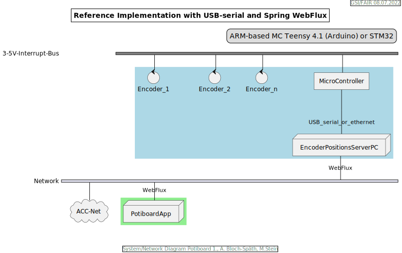
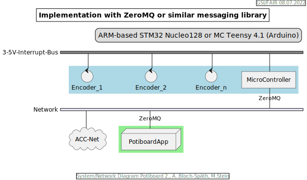

= Potiboard Rotary Encoder Software and Hardware Evaluation
Achim Bloch-Späth <a.bloch-spaeth@gsi.de>
Martin Stein <m.stein@gsi.de>
Rev. 1.0, July 8, 2022

=== Review und Motivation

Der vor ca. 6 Jahren entwickelte Potiboard-Prototyp wurde in einem der vergangenen Potiboard-Meetings als unzureichend in seiner Technologieauswahl eingestuft. Insbesondere der Einsatz einer "closed source library" des benutzten Phidget-Mikrocontroller, der zur Verarbeitung der Encodersignale dient, wurde kritisiert. Dessen Treiber läuft zudem nicht im "Userspace" auf dem zu benutzenden Linuxderivat, was aus system-administrativer Sicht sicher ein Nachteil ist.

Eine weitere Anforderung der Zukunft (FCC) könnte sein, dass die Drehgeber ihre Inkremente über Netzwerk derjenigen Applikation übermitteln müssen, die in letzter Instanz (LSA) die Inkremente den Magneten übermittelt. Diese Anforderung war beim alten Potiboard-Prototyp nicht gegeben und wurde damit nicht berücksichtigt.

=== Vom alten Potiboard-Prototyp übernommende Technologieentscheidungen und neues Referenzsystem

* Optische "Rotary Quadrature Encoder" werden wieder eingesetzt wegen ihrer Signalqualität, Zuverlässigkeit und Verfügbarkeit. Auf kugelgelagerte Modelle wir diesmal verzichtet (Haptikgründe wegen zu hoher Leichtgängigkeit). Alle anderen Merkmale sind die gleichen wie vor 6 Jahren. 16-128 Pulse pro 360-Rotation scheinen unterstützbar, ggf, muss eine Untersetzung in der Mikrocontroller-Software oder im Java-Code (vor den JAPC-Aufrufen) umgesetzt werden.
** Beispiel-Encoder sind:
*** Grayhill 63R128
*** Bourns ENA1J-B28-L00128L
* Unumgänglich, also wie gehabt, wird wieder ein Mikrokontroller benötigt, der die Inkremente der bis zu acht (8!) Encoder, ohne spürbare Zeitverzögerung, weiterverarbeitet. In Evaluierung sind folgende ARM-basierte Mikrocontroller:
** STM32H7, STM32F7
** Teensy 4.1 (Arduino kompatibel)
** Raspberry Pi 4

Alle drei Systeme stellen nachbaubare Hardware dar (Ersatzteilversorgung scheint gesichert) und lassen sich mit Open-Source Hardware betreiben. Pro Einheit bewegen sie sich in einem Kostenrahmen von 30-100 US $.
Der Mikrocontroller-Code zur Weiterverarbeitung der Encoder-Inkremente muss bzw. musste in C oder Phython geschrieben und gewartet werden.

.Referenz-Implementation

Es wurde ein Referenzsystem, wie im oberen Bild auf Basis eines Teensy 4.1 Mikrocontrollers entwickelt, der die Inkremente der Encoder in hoher Geschwindigkeit bis in eine JavaFX-Applikation weiterreicht. Das Referenzsystem kann in einem späteren Meeting genauer vorgestellt werden.

====
Die im Referenzsystem eingesetzte Datenübermittlungstechnologie basiert auf der Technologie `Spring Webflux` und dem "Reactive Toolkit" `Project Reactor`. Sie wurde ausgewählt, da sie der "GSI Controls Server-Technologie" entspricht, die für die Applikationen im FCC und HKR eingesetzt werden soll und teilweise schon eingesetzt wird.
====
Ein Nachteil und in mancherlei Hinsicht sicher auch Vorteil dieser Architektur ist die Einführung eines Webflux-Servers (siehe Bild `EncoderPositionsServerPC`), der ein PC-System mit Controls-konformen OS sein sollte. Es ist also eine zusätzliche Schicht (`Tier`) notwendig, um die Inkremente der verschiedenen Encoder (z.B. im `WebFlux`-Format) zu versenden.

Auf der Habenseite dieser Architektur steht die Anpassbarkeit und Wartbarkeit nach den Richtlinien der Controls Abteilung und damit eine sichere, kontrollierbare Netzwerkkommunikation im ACC-Netzwerk auf lange Sicht und keine Insellösung im ACC-Netz.

=== Noch in Evaluierung stehende alternative System-Architekturen und Technologien

Eine vereinfachte Architektur könnte der Einsatz einer "leichteren Netzwerk-Übertragungstechnologie" (im Vergleich mit `Spring WebFlux`) mit sich bringen. Ein Kanditat ist zum Beispiel die Technolgie `ZeroMQ`, die sich von einem Raspberry Pi 4 aus leicht einsetzen läßt. Ausstehend sind noch  Evaluierungen der Netzwerkkommunikationsmöglichkeiten mit dem leistungsfähigen STM32 Micro-Controller.

Das Ziel dieser Technologie-Evaluierungen für die neue Potiboardgeneration ist die Gegenüberstellung von mind. zwei möglichen Lösungen und deren Vergleich in Bezug auf Faktoren wie Kosten, Laufzeitverhalten, Wartbarkeit, System-Lebenserwartung, usw.

